# DESPLIEGUE — Evidencias y respuestas

Este documento recopila todas las evidencias y respuestas de la practica.

---

## Parte 1 — Evidencias minimas

### Fase 1: Instalacion y configuracion

1) Servicio Nginx activo
- Que demuestra: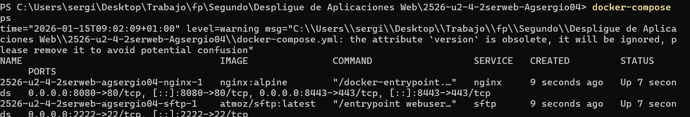
- Comando: docker-compose ps 
- Evidencia: captura de `docker compose ps` (desde fuera) o `service nginx status` (desde dentro del contenedor) mostrando el servicio activo. Nota: `systemctl` no suele funcionar dentro de Docker.

2) Configuracion cargada
- Que demuestra: 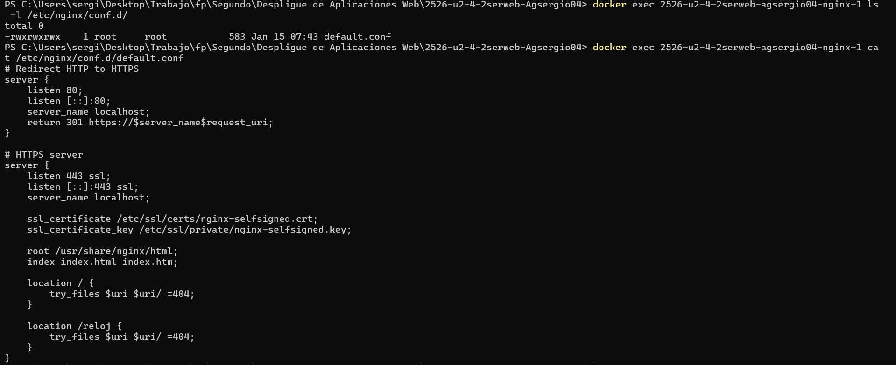
- Comando:
  - docker exec 2526-u2-4-2serweb-agsergio04-nginx-1 ls -l /etc/nginx/conf.d/
  - docker exec 2526-u2-4-2serweb-agsergio04-nginx-1 cat /etc/nginx/conf.d/default.conf
- Evidencia: captura listando el directorio de configuracion dentro del contenedor (ej: `ls -l /etc/nginx/conf.d/` o `sites-enabled` segun la imagen usada) donde se vea tu archivo `.conf`.


3) Resolucion de nombres
- Que demuestra: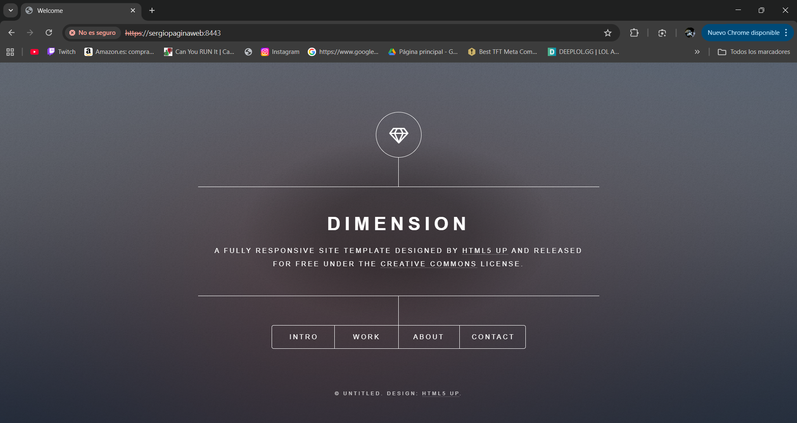
- Evidencia: captura del navegador con la barra de direcciones mostrando `http://nombre_web` (no la IP) y la pagina cargada.


4) Contenido Web
- Que demuestra:

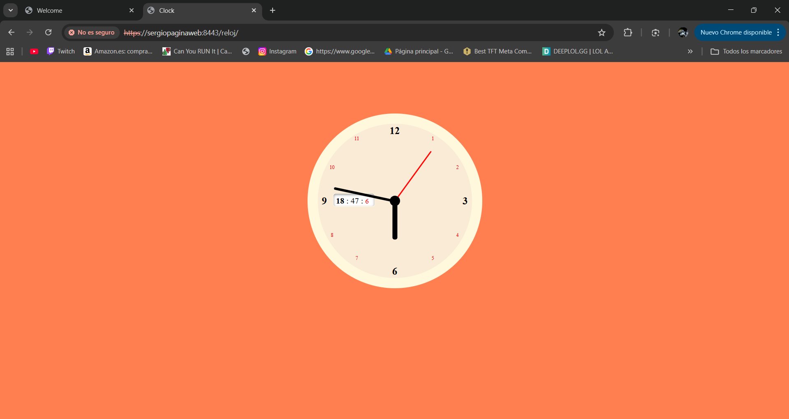
- Evidencia: la misma captura anterior, pero debe verse claramente el diseno de la web importada de Cloud Academy.


### Fase 2: Transferencia SFTP (Filezilla)

5) Conexion SFTP exitosa
- Que demuestra: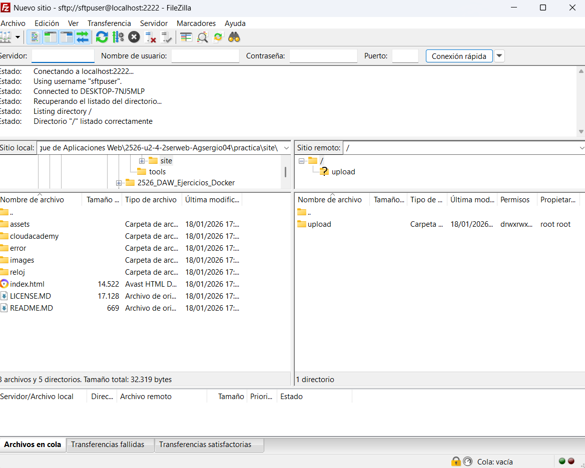
- Evidencia: captura de Filezilla mostrando en el panel de registro "Status: Connected to..." y en el panel derecho el listado de carpetas remoto. Nota: en Docker la ruta suele ser `/home/usuario/upload`, no `/var/www`.


6) Permisos de escritura
- Que demuestra: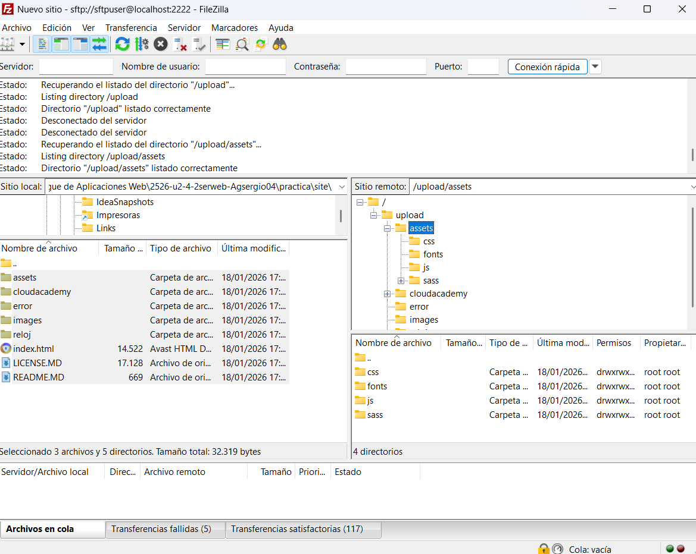
- Evidencia: captura de Filezilla mostrando la transferencia completada o los archivos ya presentes en el servidor remoto.


### Fase 3: Infraestructura Docker

7) Contenedores activos
- Que demuestra:
- Comando: docker-compose ps 
- Evidencia: captura de `docker compose ps` donde se vean los dos servicios con estado Up y los puertos `0.0.0.0:8080->80/tcp` y `0.0.0.0:2222->22/tcp`.


8) Persistencia (Volumen compartido)
- Que demuestra:
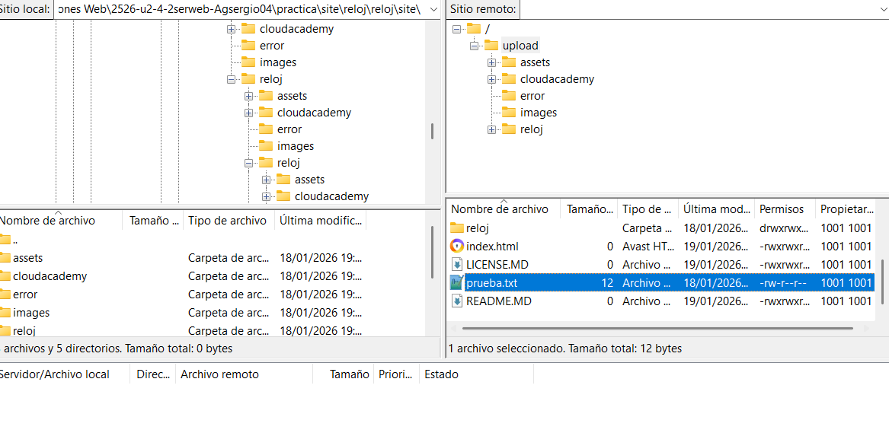

- Evidencia: evidencia cruzada (Filezilla + navegador) demostrando que lo subido al SFTP se ve en la web (por ejemplo `localhost:8080`).


9) Despliegue multi-sitio
- Que demuestra: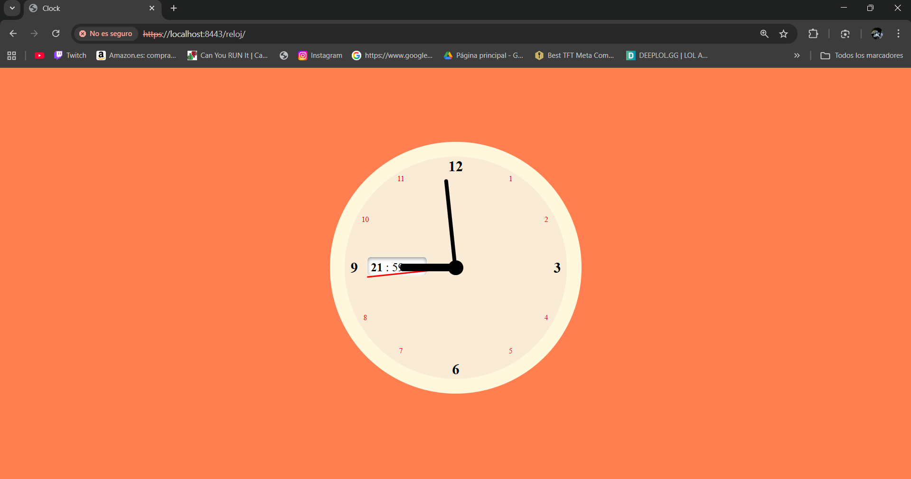
- Evidencia:  captura del navegador en `http://localhost:8080/reloj` mostrando el reloj funcionando.


### Fase 4: Seguridad HTTPS

10) Cifrado SSL
- Que demuestra:
- Evidencia: captura del navegador accediendo por `https://...` mostrando el candado (o alerta de certificado autofirmado) y el puerto configurado (ej. `8443`).


11) Redireccion forzada
- Que demuestra: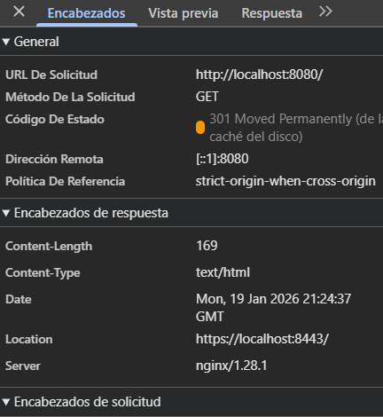
- Evidencia:  captura de la pestaña Network (DevTools) mostrando `301 Moved Permanently` al intentar entrar por HTTP.


---

## Parte 2 — Evaluacion RA2 (a–j)

### a) Parametros de administracion

Las directivas principales encontradas en `/etc/nginx/nginx.conf` son:

- `worker_processes`:
  - **Qué controla**: número de procesos worker de Nginx.
  - **configuración incorrecta y efecto**: fijar `worker_processes 16;` en una maquia virtual de 2 CPU causando  sobrecarga, conmutación de contexto y peor rendimiento; fijar `worker_processes 1;` en máquina con muchos cores. 
  - **evidencia**: `docker compose exec nginx sh -c "grep -n 'worker_processes' /etc/nginx/nginx.conf && ps aux | grep nginx"`
  
- `worker_connections`:
  - **Qué controla**: número máximo de conexiones simultáneas por worker process.
  - **configuración incorrecta y efecto**: fijar `worker_connections 50;` en un servidor con mucho tráfico.
  - **evidencia**: `docker compose exec nginx sh -c "grep -n 'worker_connections' /etc/nginx/nginx.conf && tail -n 50 /var/log/nginx/error.log"`

- `access_log`:
  - **Qué controla**: ruta/formato del log de accesos .
  - **configuración incorrecta y efecto**: apuntar a un fichero en ruta no existente o sin permisos.
  - **evidencia**:`docker compose exec nginx sh -c "ls -l /var/log/nginx/access.log && tail -n 5 /var/log/nginx/access.log"`

- `error_log`:
  - **Qué controla**: ruta y nivel de registro para errores .
  - **configuración incorrecta y efecto**: usar nivel `crit` oculta warnings útiles para depuración dificultando diagnóstico.
  - **evidencia**:`docker compose exec nginx sh -c "grep -n 'error_log' /etc/nginx/nginx.conf && tail -n 20 /var/log/nginx/error.log"`
   
- `keepalive_timeout`:
  - **Qué controla**: tiempo que Nginx mantiene una conexión keep-alive abierta tras responder.
  - **configuración incorrecta y efecto**: `keepalive_timeout 300;` en servidor con muchas conexioness inactivas ocupando recursos.
  - **evidencia**: `docker compose exec nginx sh -c "grep -n 'keepalive_timeout' /etc/nginx/nginx.conf /etc/nginx/conf.d/*.conf || true"`

- `include`:
  - **Qué controla**: inclusión de ficheros de configuración adicionales.
  - **configuración incorrecta y efecto**: `include /etc/nginx/conf.d/*.conf;` pero el directorio no existe o el patrón incluye un fichero con errores.
  - **evidencia**:`docker compose exec nginx sh -c "grep -n 'include' /etc/nginx/nginx.conf && ls -l /etc/nginx/conf.d/"`

- `gzip`:
  - **Qué controla**: compresión de respuestas HTTP .
  - **configuración incorrecta y efecto**: activar `gzip on;` sin `gzip_types` para tipos relevantes o con `gzip_comp_level 9` en CPU limitado ocupa una alta carga CPU sin beneficio real.
  - **evidencia**: `curl -I -H "Accept-Encoding: gzip" http://localhost:8080/` y `curl -I -k -H "Accept-Encoding: gzip" https://localhost:8443/`
- Evidencias:
  - evidencias/a-01-grep-nginxconf.png 
  `docker compose exec nginx sh -c "grep -nE 'worker_processes|worker_connections|access_log|error_log|gzip|include|keepalive_timeout' /etc/nginx/nginx.conf"
`
  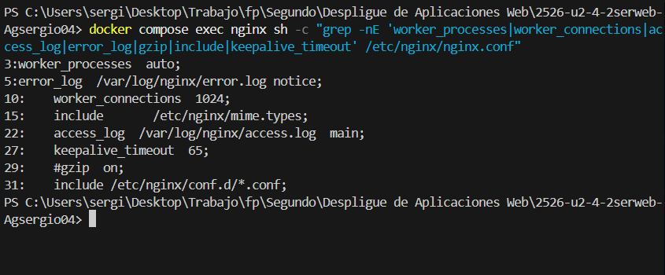
  - evidencias/a-02-nginx-t.png 
  `docker compose exec nginx nginx -t`
  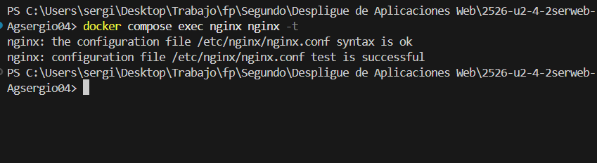
  - evidencias/a-03-reload.png 
  `docker compose exec nginx nginx -s reload`
  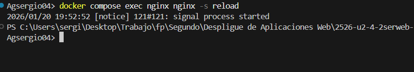

### b) Ampliacion de funcionalidad + modulo investigado
- Opcion elegida (B1 o B2):
- Respuesta:
- Evidencias (B1 o B2):
  - evidencias/b1-01-gzipconf.png 
  Que demuestra: contenido de gzip.conf (configuracion aplicada).
  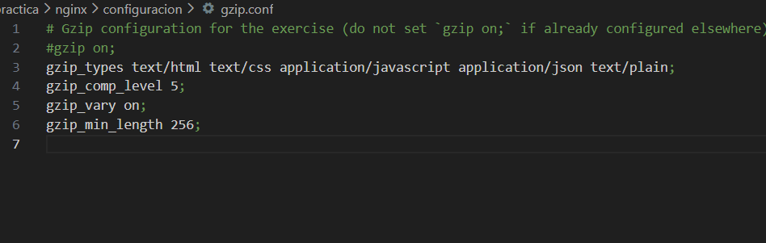
  
  - evidencias/b1-02-compose-volume-gzip.png
  Que demuestra: montaje de gzip.conf en docker-compose.yml (volumen).
  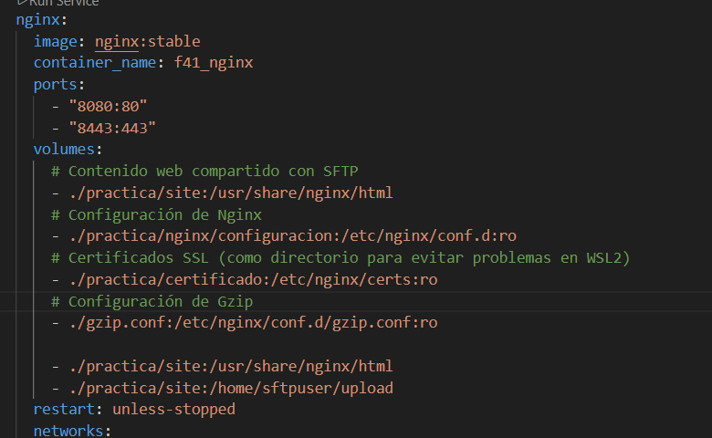

  - evidencias/b1-03-nginx-t.png
  Que demuestra: config valida.
  Comando:
  ```bash
  docker compose exec nginx nginx -t

  ```
  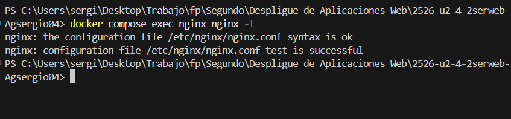
  
  - evidencias/b1-04-curl-gzip.png
   Que demuestra: Content-Encoding: gzip en respuesta.
  Comando:
    ```bash
    curl.exe -I -H "Accept-Encoding: gzip" http://localhost:8080/; curl.exe -I -k -H "Accept-Encoding: gzip" https://localhost:8443/
    ```
  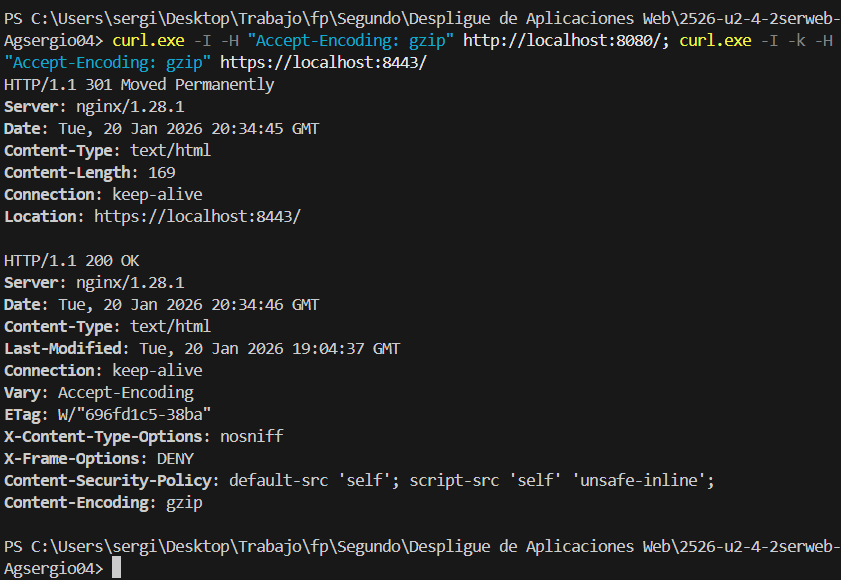
  - evidencias/b2-01-defaultconf-headers.png
  - evidencias/b2-02-nginx-t.png
  - evidencias/b2-03-curl-https-headers.png

#### Modulo investigado: <ngx_http_stub_status_module>
- Para que sirve: Proporciona acceso a información básica del estado del servidor Nginx, incluyendo métricas como conexiones activas, total de conexiones aceptadas/manejadas, peticiones procesadas y estado de los workers.

- Como se instala/carga:
Este módulo no está incluido por defecto en las compilaciones de Nginx. Para habilitarlo, debes compilar Nginx con el parámetro de configuración --with-http_stub_status_module:

​```bash
  ./configure --with-http_stub_status_module
  make
  make install
```

Sin embargo, las imágenes oficiales de Docker de Nginx (como nginx:alpine) y la mayoría de distribuciones modernas ya incluyen este módulo compilado. Puedes verificar si tu instalación lo tiene con:
​
```bash
  nginx -V 2>&1 | grep -o http_stub_status_module
  Una vez verificado, solo necesitas activarlo en la configuración añadiendo un bloque location con la directiva stub_status:
```

```text
  location = /nginx_status {
    stub_status;
  }
```

- Fuente(s):
  - Documentacion : http://nginx.org/en/docs/http/ngx_http_stub_status_module.html
  - Tutorial de instalacion : https://www.devopsschool.com/blog/how-to-enable-ngx_http_stub_status_module-in-nginx-for-nginx-metrices/

### c) Sitios virtuales / multi-sitio
- Respuesta: 

Multi-sitio por path utiliza bloques location dentro de un mismo server para servir diferentes aplicaciones o contenidos según la ruta URL solicitada llegando al mismo nombre de dominio pero se enrutan internamente según el path,por otro lado Multi-sitio por server_name crea bloques server separados, cada uno con su propio server_name, permitiendo servir contenidos completamente diferentes según el dominio solicitado.

Multi-sitio por IP es cuando el servidor tiene múltiples direcciones IP asignadas 

Multi-sitio por subdominios: Es una variante del server_name donde se configuran subdominios como practicas.com o  teletienda.com.

- Evidencias:
  - evidencias/c-01-root.png
  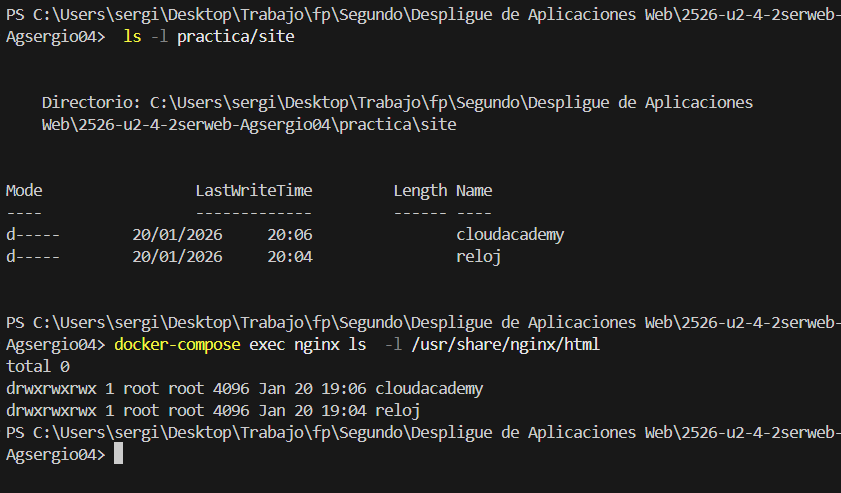

  - evidencias/c-02-reloj.png 
   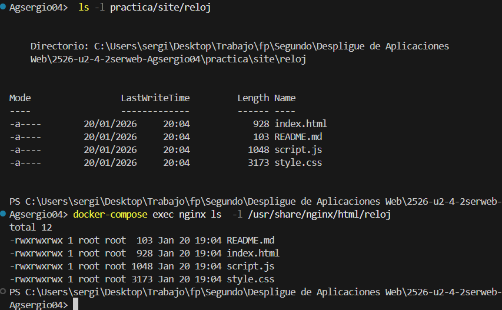
  - evidencias/c-03-defaultconf-inside.png  
  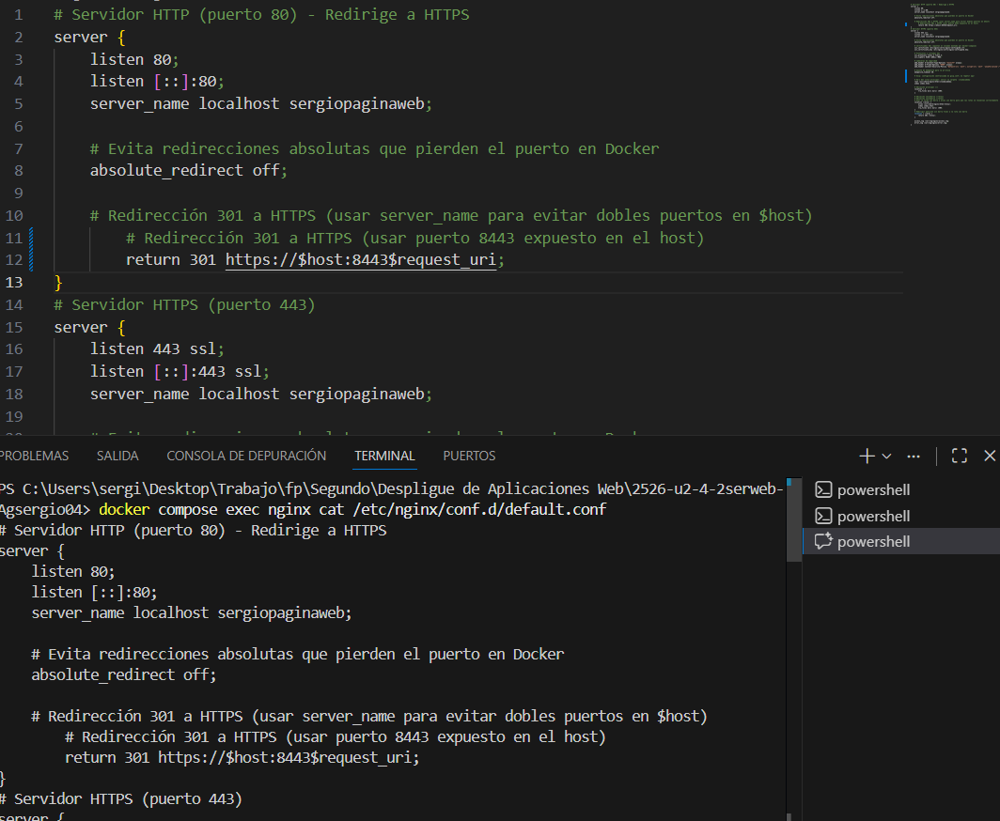

### d) Autenticacion y control de acceso
- Respuesta:
- Evidencias:
  - evidencias/d-01-admin-html.png
  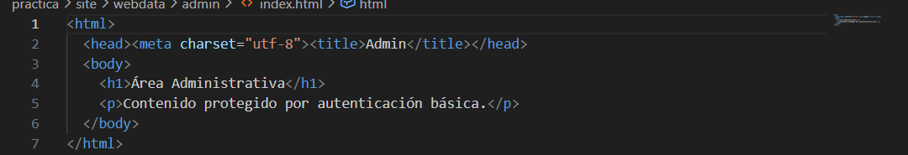
  - evidencias/d-02-defaultconf-auth.png
  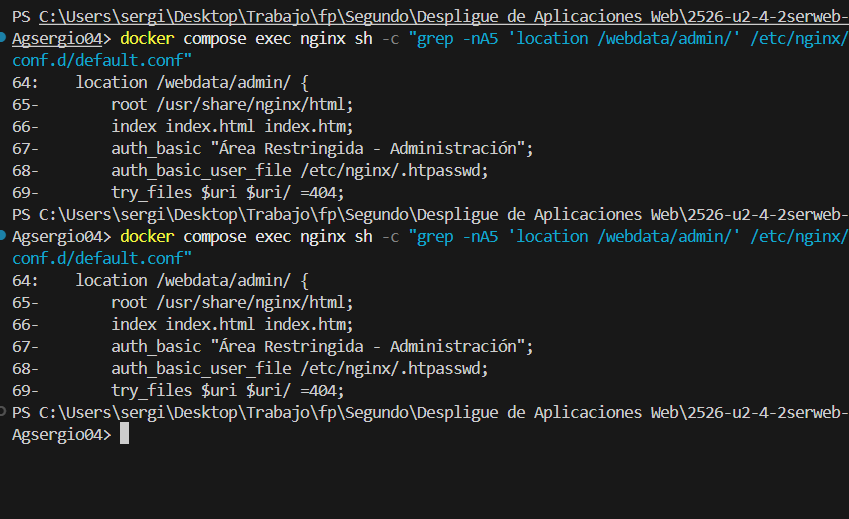
  
  - evidencias/d-03-curl-401.png
  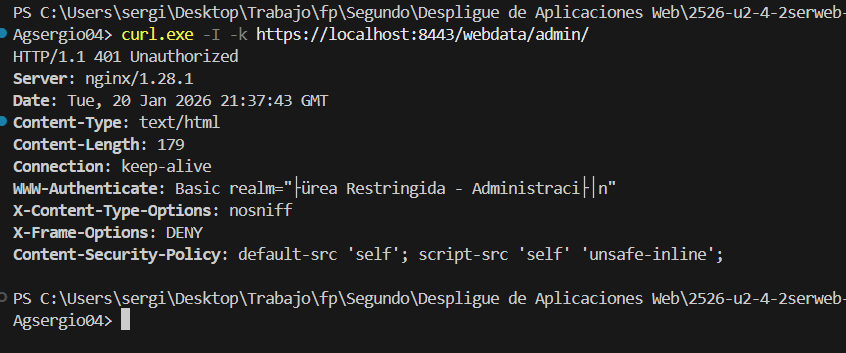
  - evidencias/d-04-curl-200.png
  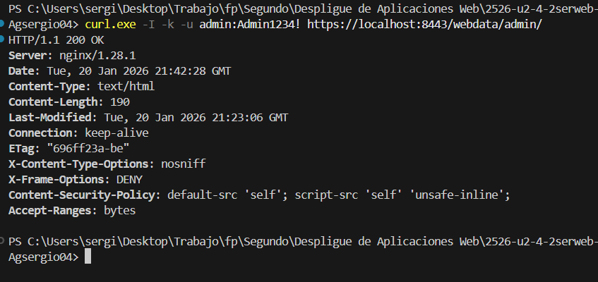

### e) Certificados digitales
- Respuesta:
.crt : Este es el archivo que contiene el certificado público firmado que verifica la autenticidad de la clave.
.key : Esta clave es secreta y debe mantenerse protegida, ya que solo el propietario del servidor debe tener acceso a ella. 

Se usa -nodes en laboratorio por simplicidad operativa y automatizacion.

Comando para generar las clave .crt y .key del proyecto: 
```bash
  openssl req -x509 -nodes -days 365 -newkey rsa:2048 -keyout nginx-selfsigned.key -out nginx-selfsigned.crt
```
- Evidencias:
  - evidencias/e-01-ls-certs.png 
  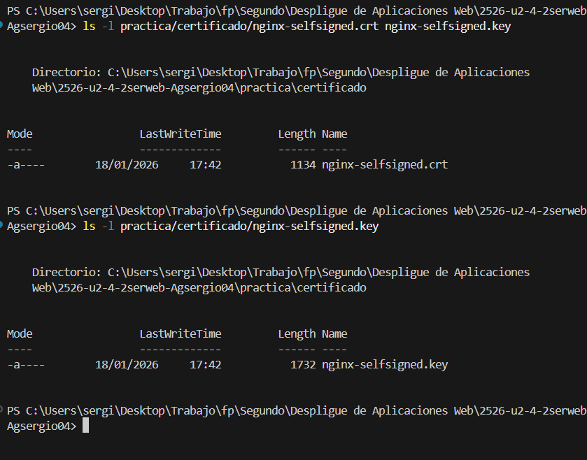
  - evidencias/e-02-compose-certs.png
  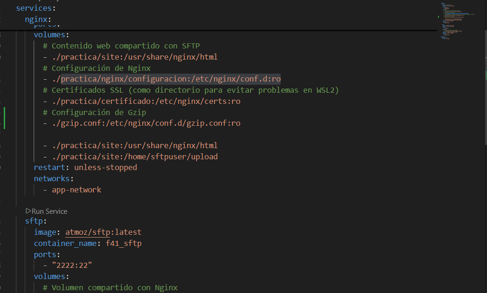
  - evidencias/e-03-defaultconf-ssl.png
  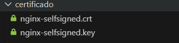

### f) Comunicaciones seguras
- Respuesta:

Se usa por varias razones el redireccionar el HTTP -> 8080 a HTTPS -> 8443 por varias razones como claridad y mantenibilidad por que todo el trafico pasa al https,esto tambien da una seguridad dado que no pasa ningun contenido por HTTP. Tambien por motivos de SEO si se le aplica la directiva 301 Moved Permanently que asi mismo mejorando el rendimiento. 
- Evidencias:
  - evidencias/f-01-https.png
  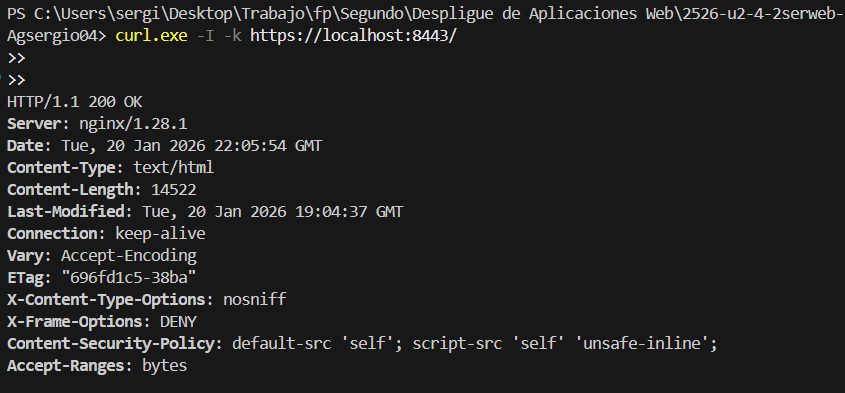
  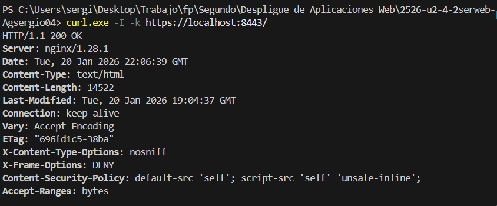
  - evidencias/f-02-301-network.png
  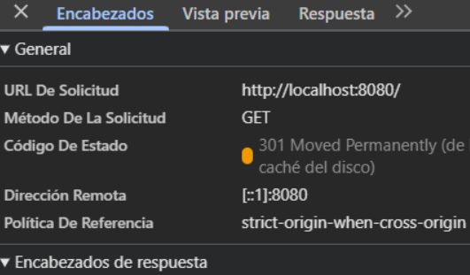

### g) Documentacion
- Respuesta:
## Documentación del despliegue (resumen)

- **Arquitectura (servicios, puertos, volúmenes):**
  - Servicios: `nginx` (imagen `nginx:stable`) y `sftp` (imagen `atmoz/sftp`).
  - Puertos mapeados: `8080:80` (HTTP), `8443:443` (HTTPS), `2222:22` (SFTP).
  - Volúmenes principales:
    - `./practica/site` -> `/usr/share/nginx/html` (contenido web y SFTP upload)
    - `./practica/nginx/configuracion` -> `/etc/nginx/conf.d` (configuración de Nginx)
    - `./practica/certificado` -> `/etc/nginx/certs` (crt/key)
    - `./gzip.conf` -> `/etc/nginx/conf.d/gzip.conf`

- **Configuración Nginx (ubicación, server blocks, root, /reloj):**
  - Fichero activo: `/etc/nginx/conf.d/default.conf` (montado desde `practica/nginx/configuracion/default.conf`).
  - Server blocks:
    - HTTP (listen 80): redirige con `return 301 https://$host:8443$request_uri`.
    - HTTPS (listen 443 ssl): sirve contenidos desde `root /usr/share/nginx/html/cloudacademy;`.
  - Multi-sitio por path:
    - `/` – sirve la web principal (`cloudacademy`).
    - `/reloj/` – `location /reloj/ { alias /usr/share/nginx/html/reloj/; }` para la app secundaria.

- **Seguridad (certificados, HTTPS, redirect, gzip):**
  - Certificados autofirmados: `nginx-selfsigned.crt` y `nginx-selfsigned.key` (montados en `/etc/nginx/certs`).
  - HTTPS habilitado en el bloque `listen 443 ssl` y redirección forzada desde HTTP→HTTPS.
  - Gzip activado mediante `gzip.conf` (centralizado) para reducir tamaño de respuestas.

- **Autenticación `/webdata/admin/` (implementada):**
  - `location /webdata/admin/` protege con `auth_basic "Área Restringida - Administración";` y `auth_basic_user_file /etc/nginx/.htpasswd;`.
  - `.htpasswd` creado dentro del contenedor (`/etc/nginx/.htpasswd`) con usuario `admin` (ej. `Admin1234!`).

- **Logs y análisis (criterio j):**
  - Rutas de logs dentro del contenedor: `/var/log/nginx/access.log` y `/var/log/nginx/error.log`.
  - Comandos de extracción de métricas (ejemplos usados):
    - Top URLs: `docker compose exec nginx sh -c "awk '{print \$7}' /var/log/nginx/access.log | sort | uniq -c | sort -nr | head"`
    - Códigos HTTP: `docker compose exec nginx sh -c "awk '{print \$9}' /var/log/nginx/access.log | sort | uniq -c | sort -nr | head"`
    - URLs con 404: `docker compose exec nginx sh -c "awk '\$9==404 {print \$7}' /var/log/nginx/access.log | sort | uniq -c | sort -nr | head"`

- Evidencias: enlaces a todas las capturas


  
  - evidencias/a-02-nginx-t.png 
  `docker compose exec nginx nginx -t`
  
  - evidencias/a-03-reload.png 
  `docker compose exec nginx nginx -s reload`
  

- evidencias/b1-01-gzipconf.png 
  Que demuestra: contenido de gzip.conf (configuracion aplicada).
  
  
  - evidencias/b1-02-compose-volume-gzip.png
  Que demuestra: montaje de gzip.conf en docker-compose.yml (volumen).
  

  - evidencias/b1-03-nginx-t.png
  Que demuestra: config valida.
  Comando:
  ```bash
  docker compose exec nginx nginx -t

  ```
  
  
  - evidencias/b1-04-curl-gzip.png
   Que demuestra: Content-Encoding: gzip en respuesta.
  Comando:
    ```bash
    curl.exe -I -H "Accept-Encoding: gzip" http://localhost:8080/; curl.exe -I -k -H "Accept-Encoding: gzip" https://localhost:8443/
    ```
  

   - evidencias/c-01-root.png
  

  - evidencias/c-02-reloj.png 
   
  - evidencias/c-03-defaultconf-inside.png  
  

    - evidencias/d-01-admin-html.png
  
  - evidencias/d-02-defaultconf-auth.png
  
  
  - evidencias/d-03-curl-401.png
  
  - evidencias/d-04-curl-200.png
  

  - evidencias/e-01-ls-certs.png 
  
  - evidencias/e-02-compose-certs.png
  
  - evidencias/e-03-defaultconf-ssl.png
   

  - evidencias/f-01-https.png
  
  
  - evidencias/f-02-301-network.png
  

  - evidencias/h-01-root.png
  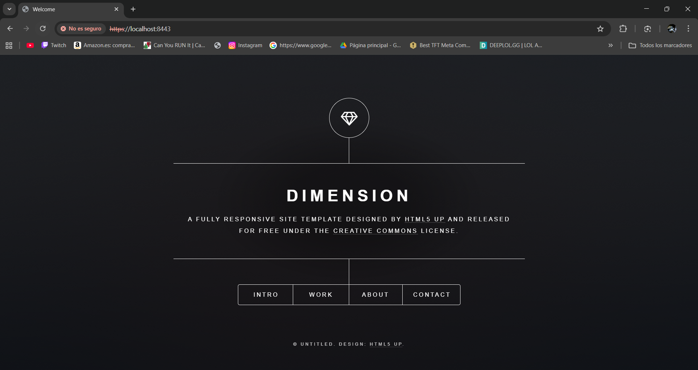
  - evidencias/h-02-reloj.png
  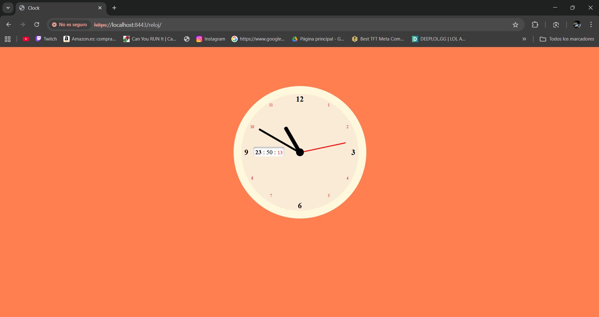

  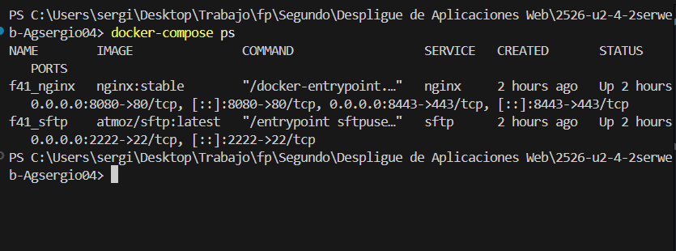

  - evidencias/j-01-logs-follow.png
  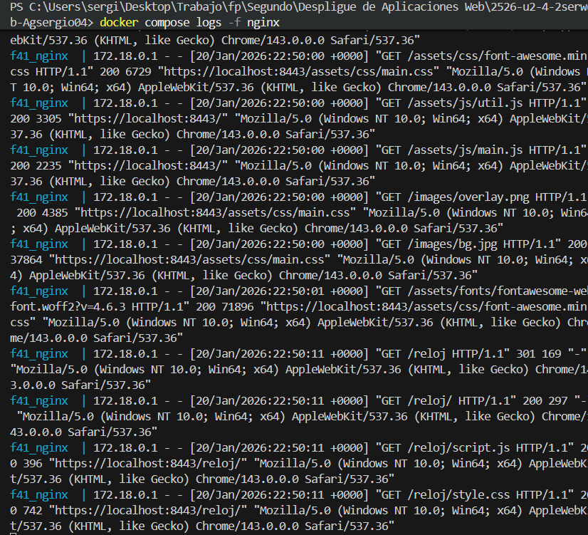
  - evidencias/j-02-metricas.png
  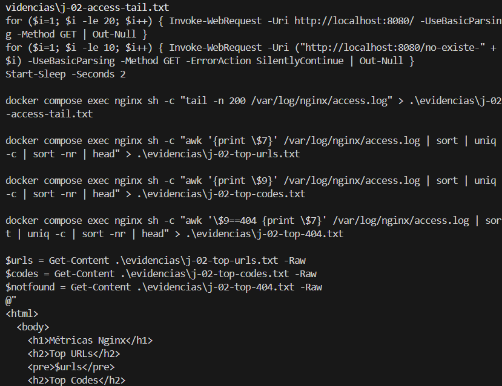

### h) Ajustes para implantacion de apps
- Respuesta:
Lo que significa es que los recursos estaticos deben usar rutas absolutas en vez de relativas sin la necesidad de que estos esten en la raiz del dominio. 

Al subir archivos por SFTP, estos quedan con permisos restrictivos y Nginx no puede leerlos, mostrando errores 403 Forbidden en el navegador pero al Ajustar permisos después de subir con chmod 644 para archivos y chmod 755 para directorios o cambiar a propietario  para que el usuario de Nginx tenga acceso de lectura.
- Evidencias:
  - evidencias/h-01-root.png
  
  - evidencias/h-02-reloj.png
  

### i) Virtualizacion en despliegue
- Respuesta:
Al instalar Nignx en el SO host mediante gestores de paquetes,este se integra completamente con el sistema de archivos, librerías compartidas y servicios del sistema sin aislamiento y con baja portabilidad entre entornos.

Por otro lado  los contenedor pueden destruirse y recrearse instantáneamente sin perder datos, ya que la configuración y contenido residen en volúmenes externos montados desde el host, garantizando portabilidad total y entornos reproducibles
- Evidencias:
  - evidencias/i-01-compose-ps.png
  

### j) Logs: monitorizacion y analisis
- Respuesta:
1. Genera trafico y errores 404:
```bash
for i in $(seq 1 20); do curl -s -o /dev/null http://localhost:8080/; done
for i in $(seq 1 10); do curl -s -o /dev/null http://localhost:8080/no-existe-$i; done
```

2. Monitoriza en tiempo real:
```bash
docker compose logs -f web
```

3. Extrae metricas basicas (top URLs, codigos, 404) desde el contenedor:
```bash
docker compose exec web sh -c "awk '{print \$7}' /var/log/nginx/access.log | sort | uniq -c | sort -nr | head"
docker compose exec web sh -c "awk '{print \$9}' /var/log/nginx/access.log | sort | uniq -c | sort -nr | head"
docker compose exec web sh -c "awk '\$9==404 {print \$7}' /var/log/nginx/access.log | sort | uniq -c | sort -nr | head"
```
- Evidencias:
  - evidencias/j-01-logs-follow.png
  

  ```bash
    docker compose logs -f nginx
  ```
  - evidencias/j-02-metricas.png
  

  ```
  docker compose exec nginx sh -c "awk '{print \$7}' /var/log/nginx/access.log | sort | uniq -c | sort -nr | head"
  docker compose exec nginx sh -c "awk '{print \$9}' /var/log/nginx/access.log | sort | uniq -c | sort -nr | head"
  docker compose exec nginx sh -c "awk '\$9==404 {print \$7}' /var/log/nginx/access.log | sort | uniq -c | sort -nr | head"

  docker compose exec nginx sh -c "awk '{print \$7}' /var/log/nginx/access.log | sort | uniq -c | sort -nr | head" > evidencias/j-02-top-urls.txt
  docker compose exec nginx sh -c "awk '{print \$9}' /var/log/nginx/access.log | sort | uniq -c | sort -nr | head" > evidencias/j-02-top-codes.txt
  docker compose exec nginx sh -c "awk '\$9==404 {print \$7}' /var/log/nginx/access.log | sort | uniq -c | sort -nr | head" > evidencias/j-02-top-404.txt
  docker compose exec nginx sh -c "tail -n 200 /var/log/nginx/access.log" > evidencias/
  ```

---

## Checklist final

### Parte 1
- [ x ] 1) Servicio Nginx activo
- [ x ] 2) Configuracion cargada
- [ x ] 3) Resolucion de nombres
- [ x ] 4) Contenido Web (Cloud Academy)
- [ x ] 5) Conexion SFTP exitosa
- [ x ] 6) Permisos de escritura
- [ x ] 7) Contenedores activos
- [ x ] 8) Persistencia (Volumen compartido)
- [ x ] 9) Despliegue multi-sitio (/reloj)
- [ x ] 10) Cifrado SSL
- [ x ] 11) Redireccion forzada (301)

### Parte 2 (RA2)
- [ x ] a) Parametros de administracion
- [ x ] b) Ampliacion de funcionalidad + modulo investigado
- [ x ] c) Sitios virtuales / multi-sitio
- [ x ] d) Autenticacion y control de acceso
- [ x ] e) Certificados digitales
- [ x ] f) Comunicaciones seguras
- [ x ] g) Documentacion
- [ x ] h) Ajustes para implantacion de apps
- [ x ] i) Virtualizacion en despliegue
- [ x ] j) Logs: monitorizacion y analisis

